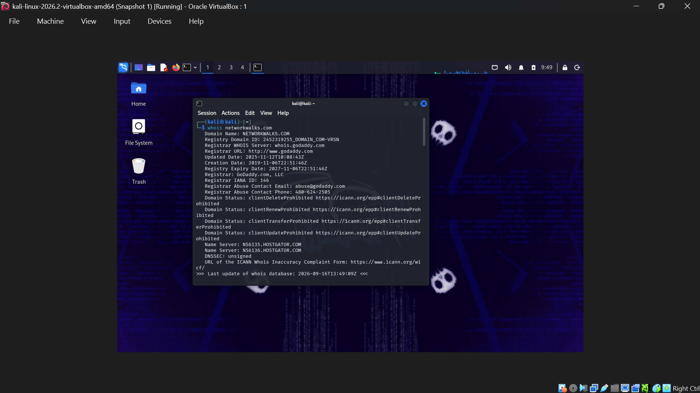
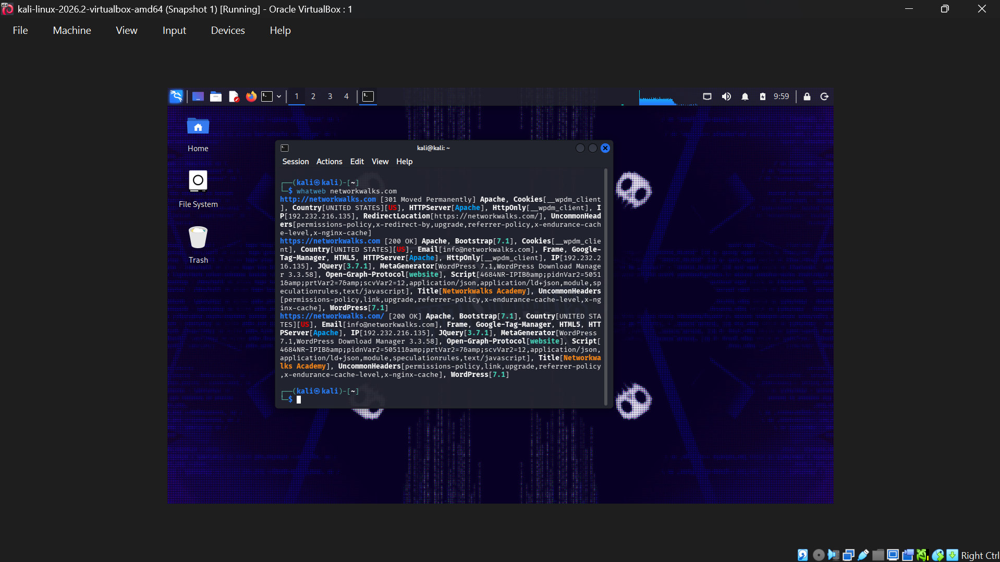
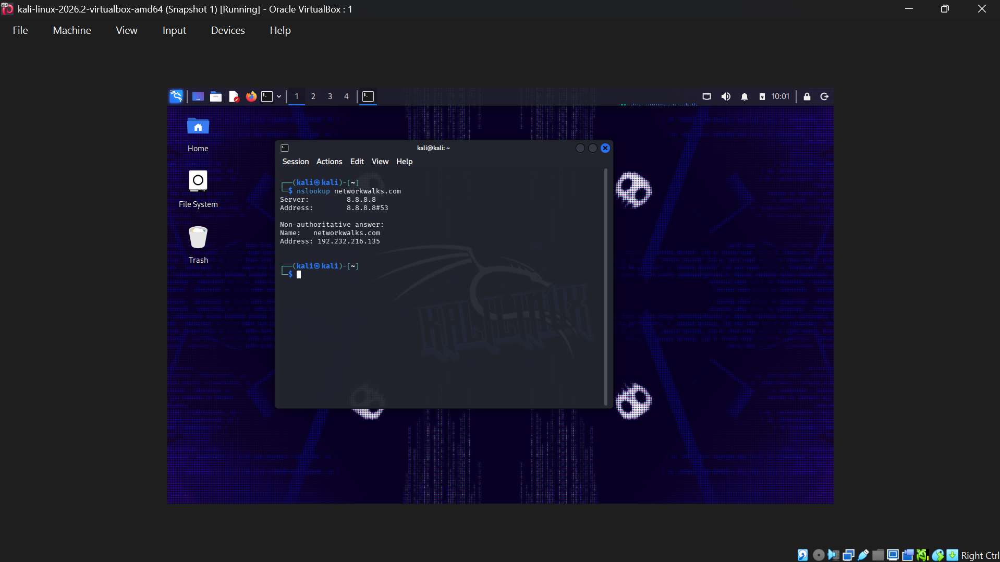
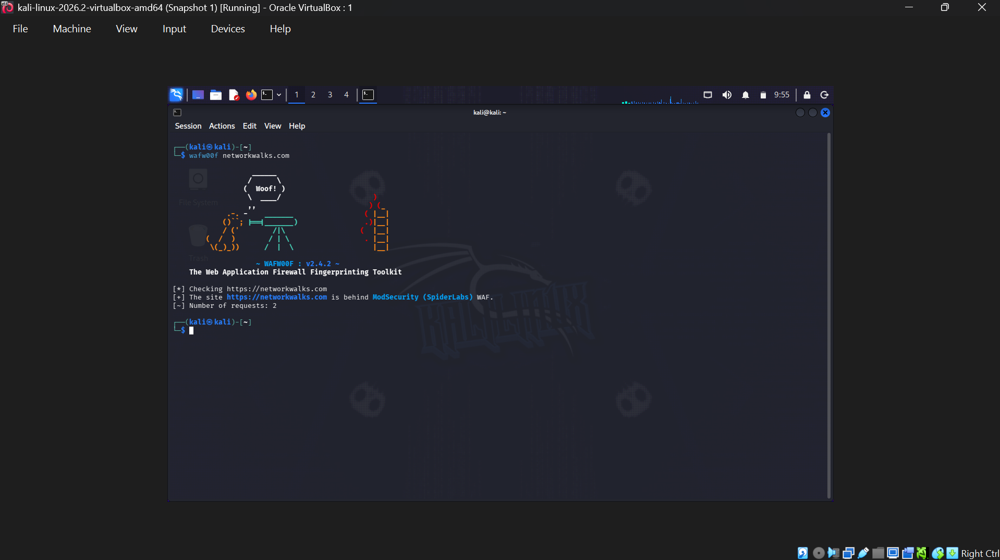
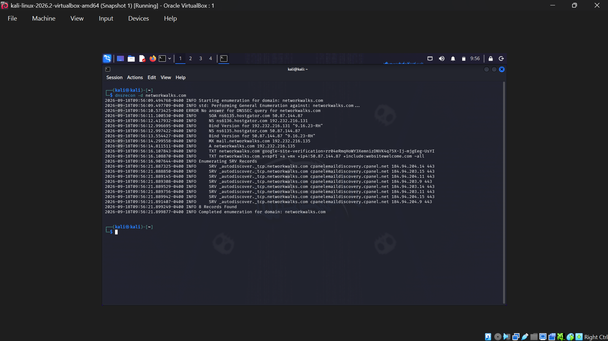

**FOOTPRINTING & NETWORK SCANNING** 
## 👤 Lab Information
 
| **Field** | **Details** |
|---|---|
| **Pentester Name**<br>*(Cybersecurity Intern)* | **ADEWUYI GODWIN** |
| **Program/Batch** | B083-Networkwalks |
| **Date** | 16 SEPTEMBER 2026 |
| **Modules Completed** | W2-PM1 (Multiple Kali Tools)<br>W2-PM2 (Zenmap Scanning) |
| **Client/Target** | 1. Networkwalks (secured written permission already)<br>2. My own local LAN Network |
| **Permission secured from client?** | **Yes** |
| **Phases Covered** | **Phase 1:** Reconnaissance & Footprinting<br>**Phase 2:** Scanning & Network Discovery |
###
 
##1. Introduction
This report documents two Week 2 cybersecurity activities completed as part of my ongoing internship at Networkwalks. The first module focuses on **domain footprinting using multiple Kali Linux tools (W2-PM1)**, while the second covers **local network discovery and scanning with Zenmap (W2-PM5)**.
Together, these exercises demonstrate the progression from **collecting publicly available information about a target to identifying and mapping active hosts within a network**.
All activities were performed using **Kali Linux for the footprinting exercises** and a **Windows PC running Zenmap for the network-scanning exercise**. Each section documents the command or procedure used, the observed output, supporting screenshot evidence, and a brief explanation of the security relevance of each finding.

## 2. 🛠️ Tools Used
 
The table below lists the tools used in this report and their respective purposes.
 
| **Tool** | **Purpose** |
|---|---|
| **Kali Linux & Windows** | Operating systems used for reconnaissance and network-scanning activities |
| **WHOIS** | Retrieve domain registration information such as ownership details, registration dates, and name servers |
| **WhatWeb** | Identify web technologies, servers, CMS platforms, plugins, and related information |
| **nslookup** | Resolve domain names to their corresponding IP addresses using DNS |
| **curl -I** | Retrieve and examine HTTP response headers from the target website |
| **WAFW00F** | Identify whether a Web Application Firewall (WAF) is protecting the website |
| **dnsrecon** | Enumerate DNS records including NS, MX, SPF, TXT, and SRV records |
| **Zenmap (Nmap GUI)** | Discover live hosts, open ports, and network information on the local subnet |
| **Windows CMD** | Identify local IP address and MAC address information |
## 3. Activities Performed
 
### 3.1 Footprinting & Reconnaissance
 
For this stage, I ran a passive assessment of **networkwalks.com** using six Kali tools — WHOIS, WhatWeb, Nslookup, cURL, Wafw00f, and DNSRecon — each one giving a different angle on the target's public-facing setup.
 
**WHOIS**
Used to pull publicly available registration data for the domain and identify its name servers, giving a picture of how the domain and its DNS setup are registered.

 

 
###
**WhatWeb**
Used to fingerprint the site's underlying technology stack. This turned up **WordPress 7.0.4** and the **WP Download Manager 3.3.58** plugin, along with other technology details the site exposes.
 
<!-- Insert screenshot here -->
 
###
**Nslookup**
Used to resolve the domain to its IP address. **networkwalks.com** resolved to **192.232.216.135**.
 

 
###
# CURL -I
Used to inspect the site's HTTP response headers, which also revealed the WordPress REST API path (`/wp-json/`).

 
###
# WAFW00F
Used to check for a Web Application Firewall in front of the site. It detected **ModSecurity (SpiderLabs)**.
  


 
###
# DNSRECON
Used to pull together the domain's DNS footprint — name servers, mail servers, SPF/TXT records, service records, and details on the DNS software in use.
  


 
Together, these results built up a picture of the target's web-server setup, its defensive controls, and its DNS infrastructure.
 
###
### 3.2 Network Scanning with Zenmap
 
The second exercise was about discovering and identifying devices on my own local network using Zenmap. The goal was to find the local IP/subnet, spot active devices along with their IP and MAC addresses, and view the network layout using Zenmap's topology feature.
 
I started by running `ipconfig` in Windows CMD to find my machine's local IP address and work out the relevant LAN subnet.
 
I then set Zenmap to scan the identified subnet (**192.168.56.1**) with a Ping Scan to find devices actively responding on the network, using:
 
```
nmap -sn -PR 192.168.1.0/24
```
 
This turned up the following live hosts:
 
- `192.168.1.1`
- `192.168.1.193`
- `192.168.1.56`
The scan also returned MAC addresses for each of the discovered devices.
 
After the discovery scan, I opened Zenmap's **Topology** tab to view the network layout, turned on the topology legend, and exported the resulting map as a **PDF**, as the exercise required.
 
---

 

 
###
 
## 4. Risk Analysis / Impact
 
The findings from both exercises carry some security implications, summarized below:
 
| # | Risk / Finding | Evidence / Observation | Potential Impact | Risk Level |
|---|---|---|---|---|
| 1 | **Web technology exposed** | WhatWeb identified **WordPress** and **WP Download Manager** running on the site | Knowing the exact components in use gives an attacker a starting point for targeted research | 🟠 Medium |
| 2 | **Web server IP exposed** | Nslookup resolved the domain to **192.232.216.135** | Reveals the network location tied to the web service | 🟡 Low |
| 3 | **HTTP header info disclosed** | cURL exposed response headers and the `/wp-json/` endpoint | Supports further fingerprinting and reconnaissance | 🟡 Low |
| 4 | **WAF technology identified** | Wafw00f detected **ModSecurity (SpiderLabs)** | Gives visibility into the site's defensive setup | 🟡 Low |
| 5 | **DNS infrastructure exposed** | DNSRecon returned DNS, mail-server, and service records | Could be combined with other data points for a fuller picture of the infrastructure | 🟠 Medium |
| 6 | **Multiple live hosts found** | Zenmap identified several responsive devices on the LAN | Unaccounted-for or unauthorized devices widen the network's attack surface | 🟠 Medium |
 
### Risk Level Key
 
- 🟡 **Low** — limited exposure, low immediate impact
- 🟠 **Medium** — could feed into further reconnaissance or add to exposure
- 🔴 **High** — significant risk requiring prompt action
---
 
## 5. Security Recommendations
 
- Keep WordPress core, plugins, and themes patched and current.
- Reduce the technical detail leaked through HTTP headers and public endpoints.
- Audit DNS records regularly and clean up anything outdated or unused.
- Keep WAF rules and configuration up to date.
- Keep an eye on the local network for unrecognized devices.
- Run vulnerability scans and network assessments on a regular schedule.
- Lock down access controls on admin panels and sensitive services.
- Turn on logging and monitor for unusual network activity.
- Keep sensitive config and system details out of public view.
- Log findings properly and confirm identified issues get resolved.
---
## 6. Conclusion
 This exercise gave me hands-on practice across the early stages of a penetration test — reconnaissance, footprinting, network discovery, and initial security assessment. It showed how a security professional builds up an understanding of a target's infrastructure step by step, using the data gathered to inform next steps.
 
During the footprinting stage, I worked through WHOIS, WhatWeb, Nslookup, cURL, Wafw00f, and DNSRecon, each surfacing a different piece of the puzzle: domain registration details, DNS setup, the site's IP address, its technology stack, HTTP header data, exposed endpoints, and its WAF. Put together, these individual data points added up to a broader view of the target's infrastructure.
The Zenmap exercise gave me practical experience with host discovery on an authorized local network. After finding my local IP and subnet through Windows networking commands, I configured Zenmap to run a discovery scan, which returned live hosts along with their IP and MAC addresses. The topology view then let me visualize how those devices sat within the network.
###
##👤 Author
 
**[ADEWUYI GODWIN OLUWAPELUMI]**
[CYBERSECURITY INTERN] | [Batch/Program ID]
LinkedIn: [www.linkedin.com/in/godwin-adewuyi-58244236b]
 
---
 
**📌 Project Information**
 
**Program Name:** Cybersecurity Internship Program at Networkwalks | **Week:** 02 | **Project:** Footprinting & Network Scanning Phases | **Repository:** GitHub
